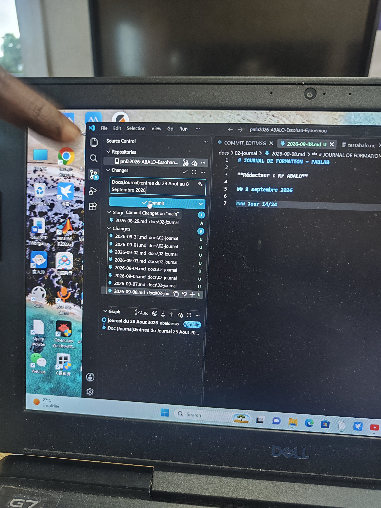

# Journal du 24 Aout 2026
## Niveau 0
# Charte des FabLabs

## Principes fondamentaux

La charte des FabLabs définit les principes qui permettent aux utilisateurs de travailler, apprendre, créer et partager dans un FabLab.

### 1. Accès
Le FabLab met à disposition des machines, des outils et des ressources permettant aux utilisateurs de réaliser leurs projets.

### 2. Apprentissage
Les utilisateurs sont encouragés à apprendre à utiliser les équipements et à partager leurs connaissances avec les autres.

### 3. Responsabilité
Chaque utilisateur est responsable de sa sécurité, de son travail et de l'utilisation correcte des machines.

### 4. Respect
Les utilisateurs doivent respecter les personnes, les équipements, les espaces de travail et les projets des autres.

### 5. Documentation
Les projets réalisés doivent être documentés afin de permettre le partage des connaissances et de faciliter la reproduction du travail.

### 6. Partage et collaboration
Le FabLab encourage la collaboration, l'entraide et le partage des connaissances entre les membres.

### 7. Ouverture
Les FabLabs favorisent l'accès aux technologies et l'innovation au bénéfice de la communauté.

