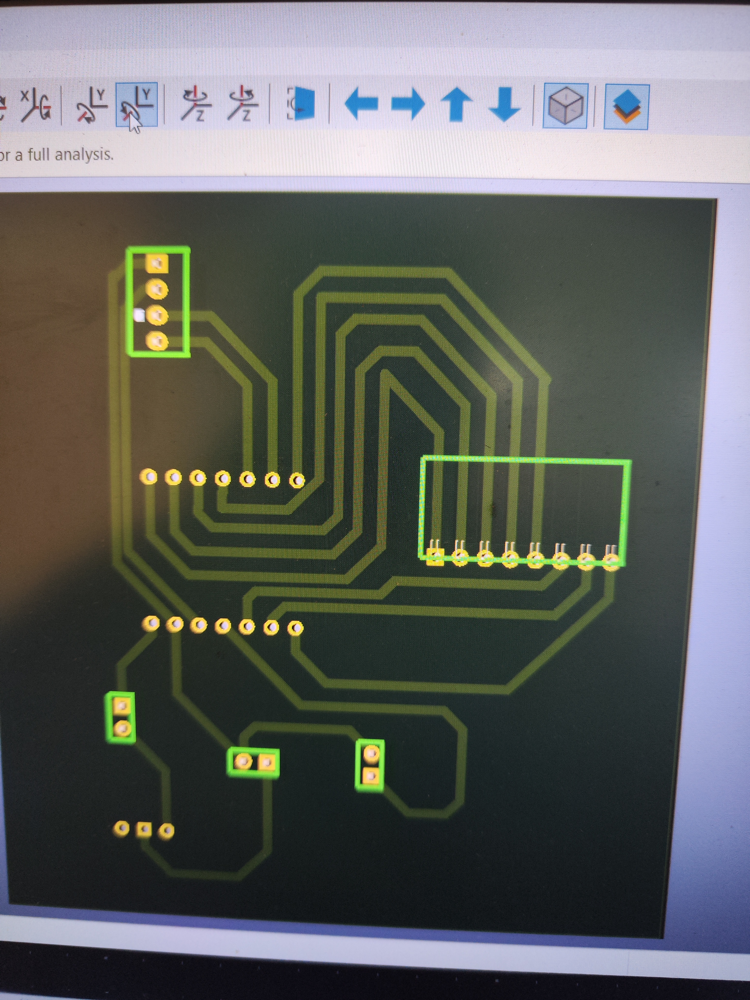

# JOURNAL DE FORMATION – FABLAB

## 12 septembre 2026

**Rédacteur : Mr ABALO**

### Jour 18/24

---

## 1. Poursuite de la conception du PCB

Nous avons poursuivi le travail de conception du **PCB de notre projet**.

Cette séance nous a permis d'avancer sur la préparation de la carte électronique destinée à intégrer les différents composants de notre système.

Nous avons notamment continué à travailler sur :

- l'organisation des composants sur la carte ;
- la vérification des connexions électriques ;
- le placement des composants ;
- le routage des pistes ;
- la vérification générale du circuit avant sa fabrication.

L'objectif est d'obtenir une carte électronique propre, fonctionnelle et adaptée aux dimensions de notre future coque.

---

## 2. Compétences pratiques acquises

Au cours de cette séance, j'ai renforcé mes compétences dans :

- la conception d'un PCB ;
- le placement et l'organisation des composants électroniques ;
- le routage des pistes ;
- la vérification d'un circuit avant fabrication ;
- l'adaptation du PCB aux contraintes du projet.

---

## 3. Conclusion

Cette journée a été consacrée à la **poursuite de la conception du PCB** de notre projet. Ce travail constitue une étape importante avant la fabrication de la carte électronique finale et son intégration dans la coque du dispositif.