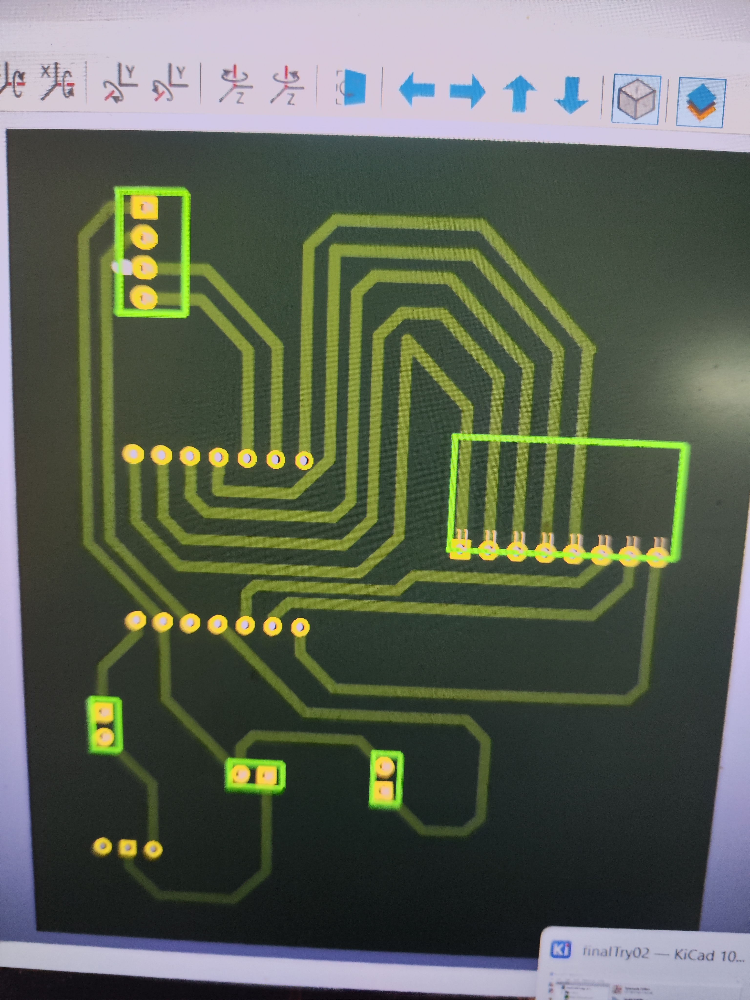

# JOURNAL DE FORMATION – FABLAB

## 16 septembre 2026

**Rédacteur : Mr ABALO**

### Jour 21/24

---

## 1. Poursuite de la réalisation du projet

La journée a été consacrée à la poursuite de l'intégration de notre système et à la préparation de sa version finale.

Nous avons travaillé simultanément sur deux solutions : le **PCB cuivré en cours d'assemblage** et le **PCB perforé déjà utilisé pour le prototype**. Cette comparaison nous a permis d'identifier les difficultés techniques et d'apporter progressivement des améliorations à notre réalisation.

---

## 2. Câblage des composants sur le PCB cuivré

Nous avons commencé le câblage et la soudure des composants sur le **PCB cuivré**.

Cependant, au cours de cette étape, nous avons constaté que le **schéma électronique réalisé précédemment comportait des erreurs**. Certaines connexions ne correspondaient donc pas au fonctionnement attendu du système.

Nous avons également rencontré des difficultés au niveau de la soudure. Pour tenter de corriger certaines liaisons défectueuses, nous avons réalisé de nouveaux perçages et essayé de rétablir les connexions nécessaires.

Malgré ces corrections, la combinaison des erreurs du circuit et des difficultés de soudure rendait progressivement le montage trop complexe et augmentait le risque d'obtenir un circuit peu fiable.

---

## 3. Analyse, correction et nouvelle conception

Face aux difficultés rencontrées, nous avons adopté une démarche de résolution de problème plutôt que de poursuivre un montage devenu difficile à maîtriser.

Nous avons donc repris l'organisation du circuit afin de corriger les connexions et d'améliorer la conception.

La démarche suivie a été :

**Identifier le problème → analyser les erreurs → modifier le circuit → générer un nouveau PCB → fabriquer une nouvelle version → tester.**

Nous avons ainsi effectué les modifications nécessaires dans **KiCad**, généré une nouvelle version du PCB et lancé sa fabrication à l'aide de la **machine laser**.

Cette étape nous a permis de comprendre qu'en fabrication numérique, une erreur détectée lors de l'assemblage peut nécessiter un retour à l'étape de conception afin d'obtenir une solution plus fiable.

---

## 4. Poursuite du prototype sur PCB perforé

Parallèlement à la nouvelle conception du PCB cuivré, nous avons poursuivi le travail sur le **PCB perforé**.

Nous avons assemblé les différents éléments du système dans la coque et procédé à un premier essai.

Les résultats obtenus étaient **encourageants** : le système a pu être intégré et testé dans son ensemble.

Cette phase nous a permis de vérifier non seulement le fonctionnement électronique, mais également l'intégration physique des composants dans la coque.

---

## 5. Adaptation de la coque

Lors de l'intégration du système avec le PCB perforé, nous avons constaté que la coque initialement prévue ne permettait pas de contenir correctement l'ensemble du montage.

Nous avons donc dû **repenser et refaire la coque** afin de l'adapter aux dimensions réelles du système assemblé.

Cette situation illustre l'importance du prototypage : les dimensions théoriques définies lors de la modélisation doivent parfois être ajustées après l'assemblage réel des composants.

La démarche devient ainsi :

**Modéliser → fabriquer → assembler → tester → constater → modifier → refabriquer.**

---

## 6. Approche FabLab et apprentissage par l'erreur

Cette journée a été particulièrement riche en apprentissages pratiques.

Les problèmes rencontrés au niveau du schéma électronique, de la soudure et de l'intégration mécanique nous ont obligés à analyser la situation et à rechercher des solutions.

Dans l'esprit FabLab, l'erreur n'est pas considérée uniquement comme un échec : elle constitue une **source d'apprentissage et d'amélioration du prototype**.

En tant que futur enseignant FabLab, cette expérience me montre l'importance de permettre aux apprenants de manipuler, tester, rencontrer des difficultés et rechercher eux-mêmes des solutions. Le processus de fabrication devient ainsi un véritable support d'apprentissage.

---

## 7. Compétences pratiques acquises

Au cours de cette journée, j'ai renforcé mes compétences dans :

- le câblage et la soudure sur PCB ;
- l'identification d'erreurs dans un circuit électronique ;
- la recherche et la correction de connexions défectueuses ;
- la modification d'un circuit dans KiCad ;
- la génération d'une nouvelle version d'un PCB ;
- la fabrication d'un PCB à l'aide d'une machine laser ;
- l'intégration d'un circuit électronique dans une coque ;
- l'adaptation d'une conception 3D aux dimensions réelles du prototype ;
- le diagnostic et la résolution de problèmes techniques ;
- l'application de la démarche **concevoir → fabriquer → tester → corriger → améliorer**.

---

## 8. Préparation de la finalisation et de la présentation

Les résultats obtenus aujourd'hui nous permettent d'avancer vers la finalisation du projet.

Pour la prochaine séance, nous prévoyons de :

- effectuer les dernières mises à jour du circuit ;
- finaliser la coque et l'intégration des composants ;
- effectuer les derniers tests ;
- corriger les éventuelles erreurs restantes ;
- préparer le prototype pour la présentation ;
- organiser les éléments nécessaires à la présentation du **vendredi 18 septembre 2026**.

---

## 9. Conclusion

Cette journée a été marquée par plusieurs difficultés techniques, mais également par des progrès importants.

Les erreurs constatées sur le circuit nous ont conduits à reprendre la conception dans KiCad et à produire une nouvelle version du PCB. En parallèle, le prototype réalisé sur PCB perforé a donné des résultats encourageants après son intégration dans la coque.

Cette expérience montre concrètement l'esprit du FabLab : **une réalisation n'est pas nécessairement définitive du premier coup. Elle évolue grâce aux tests, aux erreurs, aux corrections et aux améliorations successives.**

La prochaine étape sera consacrée à la finalisation du prototype et à la préparation de sa présentation.