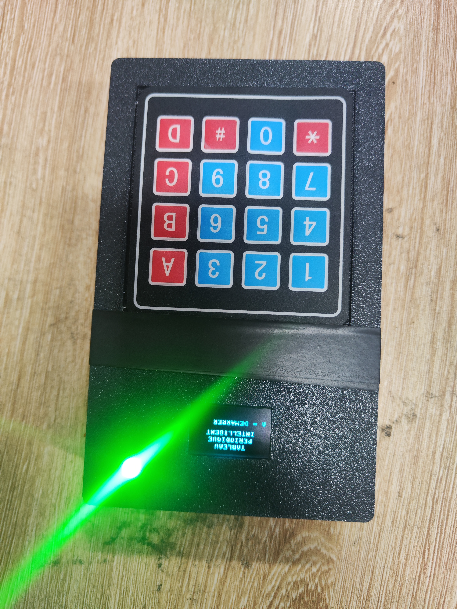

# JOURNAL DE FORMATION – FABLAB

## 17 septembre 2026

**Rédacteur : Mr ABALO**

### Jour 22/24

---

## 1. Finalisation de notre projet

Cette journée a été consacrée à la **finalisation technique de notre projet**. Après plusieurs séances de conception, de fabrication, de programmation, de soudure et de tests, nous avons effectué les dernières corrections nécessaires avant la présentation.

Les principaux travaux réalisés ont porté sur :

- la finalisation du PCB ;
- l'adaptation et la finalisation de la boîte ;
- la correction du programme Python ;
- l'intégration de tous les éléments ;
- les tests fonctionnels du système ;
- la préparation de la présentation PowerPoint.

---

## 2. Finalisation du PCB et intégration

Nous avons terminé les travaux sur le **PCB** et poursuivi l'intégration des différents composants dans la boîte.

Après les difficultés rencontrées lors des séances précédentes, nous avons vérifié les connexions et l'organisation du circuit afin de garantir le bon fonctionnement de l'ensemble.

La boîte a également été adaptée pour permettre une intégration correcte du PCB, de l'écran, du clavier et des autres composants.

---

## 3. Correction et reprogrammation du système

Une dernière correction importante a été apportée au programme Python.

Le problème ne concernait pas uniquement le programme lui-même : il fallait surtout **faire correspondre correctement les broches utilisées dans le programme avec le câblage réellement réalisé sur le PCB**.

Nous avons donc repris l'affectation des broches dans le programme afin qu'elle corresponde exactement aux connexions physiques du circuit.

Après cette reprogrammation, nous avons effectué plusieurs essais pour vérifier la communication entre le programme et les différents composants.

---

## 4. Fonctionnement du quiz

Le test final a été réalisé sous la forme d'un **quiz interactif destiné à l'apprentissage des 20 premiers éléments du tableau périodique**.

Le fonctionnement du système est le suivant :

1. L'élève appuie sur le bouton **« Démarrer »** ;
2. Le système sélectionne aléatoirement un élément parmi les **20 premiers éléments du tableau périodique** ;
3. L'élève doit renseigner le numéro atomique **Z = ?** ;
4. Après validation, le système demande **A = ?** ;
5. L'élève renseigne ensuite la **ligne** ;
6. Enfin, il renseigne la **colonne** ;
7. Le système évalue les différentes réponses ;
8. Un **score sur 4** est affiché à la fin de la tentative ;
9. L'élève dispose d'une **deuxième tentative** ;
10. Après cette tentative, la correction est affichée ;
11. Le quiz reprend ensuite avec un nouvel élément.

Lorsqu'une réponse est fausse, le **buzzer est activé** afin de fournir un retour sonore immédiat à l'élève.

Cette organisation permet de transformer l'apprentissage en une activité interactive dans laquelle l'élève répond, reçoit un retour et peut recommencer.

---

## 5. Test et validation du prototype

Après les corrections du programme et l'intégration de l'ensemble des composants, nous avons effectué le **test complet du système**.

Le test a permis de vérifier simultanément :

- le fonctionnement du clavier ;
- l'affichage sur l'écran OLED ;
- la sélection aléatoire des éléments ;
- l'enregistrement des réponses ;
- le calcul du score ;
- la gestion de la deuxième tentative ;
- l'affichage de la correction ;
- le fonctionnement du buzzer en cas de mauvaise réponse ;
- la communication entre le programme et les composants électroniques.

Les résultats obtenus sont satisfaisants : **le système fonctionne comme prévu**.

Cette validation constitue une étape importante, car elle confirme que les différentes parties du projet fonctionnent ensemble dans la configuration finale.

---

## 6. Préparation de la présentation

Une fois le prototype finalisé et testé, nous avons consacré une partie de la journée à la préparation de notre **présentation PowerPoint**.

Nous avons organisé les différentes parties de la présentation afin d'expliquer clairement :

- le contexte et le besoin ;
- l'objectif du projet ;
- le fonctionnement du système ;
- les composants utilisés ;
- la conception électronique ;
- la programmation ;
- la conception et la fabrication de la boîte ;
- les différentes étapes du prototypage ;
- les difficultés rencontrées et les solutions apportées ;
- les résultats obtenus.

---

## 7. Répartition des rôles dans le groupe

Nous avons également procédé à la **répartition des rôles pour la présentation**.

Chaque membre du groupe s'est vu attribuer une partie du projet à présenter. Cette organisation permet à chacun de participer à la restitution du travail collectif et de mieux maîtriser les aspects techniques liés à sa partie.

Nous avons également commencé à préparer notre présentation orale afin d'être capables d'expliquer non seulement le résultat final, mais aussi la démarche suivie pour parvenir au prototype.

---

## 8. Esprit FabLab et apprentissage par la pratique

La réalisation de ce projet nous a permis de suivre une démarche complète de fabrication numérique et de prototypage :

**Idée → Conception → Simulation → Programmation → Fabrication → Assemblage → Test → Correction → Amélioration → Validation.**

Les différentes difficultés rencontrées au cours du projet, notamment au niveau du PCB, du câblage, de la soudure, de la boîte et de la programmation, nous ont obligés à analyser les problèmes et à rechercher des solutions concrètes.

En tant que futur **enseignant FabLab**, cette expérience est particulièrement enrichissante. Elle montre que l'erreur et l'expérimentation peuvent devenir de véritables outils pédagogiques.

L'apprenant ne se contente pas d'utiliser une solution déjà réalisée : il participe à sa conception, la fabrique, la teste, identifie ses limites et cherche à l'améliorer.

---

## 9. Compétences pratiques acquises

Cette journée m'a permis de renforcer mes compétences dans :

- la finalisation d'un prototype électronique ;
- l'intégration d'un PCB dans une structure imprimée en 3D ;
- l'adaptation d'un programme aux connexions physiques d'un circuit ;
- la programmation d'un système interactif de quiz ;
- la gestion des entrées utilisateur et des réponses ;
- la gestion d'un score et de plusieurs tentatives ;
- l'utilisation d'un retour sonore avec un buzzer ;
- la réalisation de tests fonctionnels ;
- la validation d'un prototype complet ;
- la préparation d'une présentation technique ;
- le travail collaboratif et la répartition des responsabilités.

---

## 10. Conclusion

Cette journée marque une étape majeure dans la réalisation de notre projet.

Nous avons terminé les travaux sur le **PCB**, adapté la boîte, corrigé le programme afin de faire correspondre les broches programmées avec le câblage réel et réalisé les tests du système.

Le quiz fonctionne comme prévu : l'élève peut démarrer une activité, répondre successivement aux questions sur **Z, A, la ligne et la colonne**, obtenir un score sur 4, bénéficier d'une deuxième tentative et recevoir une correction. Le buzzer fournit également un retour sonore lorsqu'une réponse est incorrecte.

Après la validation technique, nous avons préparé le **PowerPoint** et réparti les rôles entre les membres du groupe en vue de la présentation finale.

Cette expérience constitue une application concrète de l'esprit FabLab : **apprendre en faisant, expérimenter, résoudre les problèmes, améliorer le prototype et partager les connaissances acquises**.